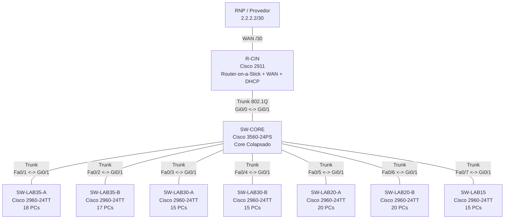

# E1 - Design Físico e Topologia

**Projeto:** Reestruturação da Rede dos Laboratórios do CIn-UFPE  
**Entrega:** E1 - Design Físico e Topologia  
**Data de entrega:** 01/05/2026  
**Critério principal:** Racionalidade

## 1. Objetivo da Entrega

Esta entrega documenta o desenho físico inicial da rede, a alocação dos equipamentos disponíveis, a justificativa para a quantidade de switches de acesso e a identificação das portas configuradas como **Trunk** e **Access**.

O desenho foi planejado para suportar cinco laboratórios simulados, cada um associado a uma VLAN própria nas próximas entregas. A topologia usa um modelo hierárquico com **Core Colapsado**, no qual o switch core concentra as funções de distribuição e agregação.

## 2. Visão Geral da Topologia

## 3. Equipamentos Utilizados

| Equipamento | Modelo | Qtd | Função na Topologia | Conexões |
| --- | --- | ---: | --- | --- |
| Roteador de Borda | Cisco 2911 | 1 | Conexão com a RNP, roteamento Inter-VLAN via Router-on-a-Stick e serviço DHCP | Gi0/0 -> SW-CORE Gi0/1; Gi0/1 -> RNP 2.2.2.2/30 |
| Switch Core | Cisco 3560-24PS | 1 | Core colapsado; agrega todos os switches de acesso e concentra os trunks das VLANs | Gi0/1 -> R-CIN Gi0/0; Fa0/1-Fa0/7 -> switches de acesso |
| Switches de Acesso | Cisco 2960-24TT | 7 | Conexão dos hosts, isolamento por VLAN e encaminhamento ao core via trunk | Gi0/1 -> SW-CORE; Fa0/x -> PCs |
| PCs | PC | 120 | Dispositivos finais dos laboratórios simulados | Placas FastEthernet -> portas Access dos switches |

## 4. Justificativa da Quantidade de Switches de Acesso

Cada switch Cisco 2960-24TT possui 24 portas FastEthernet para hosts e portas GigabitEthernet para uplink. Como o projeto deve acomodar laboratórios de 35, 30, 20, 20 e 15 hosts, a distribuição mínima racional é:

| Laboratório | Hosts | Switches Necessários | Justificativa |
| --- | ---: | ---: | --- |
| Lab 35 | 35 | 2 | Um único switch de 24 portas não comporta 35 hosts. Divisão em 18 + 17 hosts. |
| Lab 30 | 30 | 2 | Um único switch de 24 portas não comporta 30 hosts. Divisão em 15 + 15 hosts. |
| Lab 20-A | 20 | 1 | Um switch comporta todos os hosts e mantém portas livres para manutenção. |
| Lab 20-B | 20 | 1 | Um switch comporta todos os hosts e mantém portas livres para manutenção. |
| Lab 15 | 15 | 1 | Um switch comporta todos os hosts com folga. |
| **Total** | **120** | **7** | Usa todos os switches disponíveis sem desperdiçamento estrutural. |

Essa distribuição respeita a capacidade física dos switches, evita concentrar laboratórios grandes em equipamentos insuficientes e preserva organização lógica para as VLANs.

## 5. Nomenclatura Proposta

| Nome | Dispositivo | Laboratório / Função |
| --- | --- | --- |
| R-CIN | Cisco 2911 | Roteador de borda do CIn |
| SW-CORE | Cisco 3560-24PS | Switch core colapsado |
| SW-LAB35-A | Cisco 2960-24TT | Primeira parte do laboratório de 35 hosts |
| SW-LAB35-B | Cisco 2960-24TT | Segunda parte do laboratório de 35 hosts |
| SW-LAB30-A | Cisco 2960-24TT | Primeira parte do laboratório de 30 hosts |
| SW-LAB30-B | Cisco 2960-24TT | Segunda parte do laboratório de 30 hosts |
| SW-LAB20-A | Cisco 2960-24TT | Laboratório de 20 hosts |
| SW-LAB20-B | Cisco 2960-24TT | Laboratório de 20 hosts |
| SW-LAB15 | Cisco 2960-24TT | Laboratório de 15 hosts |

## 6. Plano de Portas Trunk

As portas trunk devem transportar as VLANs dos laboratórios entre os switches de acesso, o switch core e o roteador. A numeração final das VLANs será formalizada na E3; para este desenho físico, considera-se uma VLAN por laboratório.

| Origem | Porta | Destino | Porta | Tipo | Observação |
| --- | --- | --- | --- | --- | --- |
| R-CIN | Gi0/0 | SW-CORE | Gi0/1 | Trunk 802.1Q | Link para Router-on-a-Stick; transporta todas as VLANs internas |
| R-CIN | Gi0/1 | RNP | Interface do provedor | WAN | Link externo /30 para 2.2.2.2 |
| SW-CORE | Fa0/1 | SW-LAB35-A | Gi0/1 | Trunk | Transporta a VLAN do Lab 35 |
| SW-CORE | Fa0/2 | SW-LAB35-B | Gi0/1 | Trunk | Transporta a VLAN do Lab 35 |
| SW-CORE | Fa0/3 | SW-LAB30-A | Gi0/1 | Trunk | Transporta a VLAN do Lab 30 |
| SW-CORE | Fa0/4 | SW-LAB30-B | Gi0/1 | Trunk | Transporta a VLAN do Lab 30 |
| SW-CORE | Fa0/5 | SW-LAB20-A | Gi0/1 | Trunk | Transporta a VLAN do Lab 20-A |
| SW-CORE | Fa0/6 | SW-LAB20-B | Gi0/1 | Trunk | Transporta a VLAN do Lab 20-B |
| SW-CORE | Fa0/7 | SW-LAB15 | Gi0/1 | Trunk | Transporta a VLAN do Lab 15 |

## 7. Plano de Portas Access

As portas de acesso conectam os PCs de cada laboratorio. Cada grupo de portas deve ser associado a uma VLAN especifica na E3.

| Switch de Acesso | Laboratório | Portas Access para PCs | Quantidade de PCs | Observação |
| --- | --- | --- | ---: | --- |
| SW-LAB35-A | Lab 35 | Fa0/1-Fa0/18 | 18 | Mesma VLAN do Lab 35 |
| SW-LAB35-B | Lab 35 | Fa0/1-Fa0/17 | 17 | Mesma VLAN do Lab 35 |
| SW-LAB30-A | Lab 30 | Fa0/1-Fa0/15 | 15 | Mesma VLAN do Lab 30 |
| SW-LAB30-B | Lab 30 | Fa0/1-Fa0/15 | 15 | Mesma VLAN do Lab 30 |
| SW-LAB20-A | Lab 20-A | Fa0/1-Fa0/20 | 20 | VLAN própria do laboratório |
| SW-LAB20-B | Lab 20-B | Fa0/1-Fa0/20 | 20 | VLAN própria do laboratório |
| SW-LAB15 | Lab 15 | Fa0/1-Fa0/15 | 15 | VLAN própria do laboratório |

As portas FastEthernet restantes devem permanecer desligadas administrativamente até uso futuro, reduzindo risco de conexões indevidas.

## 8. Racionalidade do Design

O desenho usa uma topologia em estrela hierárquica, com todos os switches de acesso conectados ao SW-CORE. Essa escolha simplifica o gerenciamento, facilita troubleshooting e permite que o tráfego entre VLANs seja encaminhado de forma centralizada pelo R-CIN.

O switch core atua como ponto de agregação e não conecta PCs diretamente. Essa separação deixa clara a função de cada camada: os switches 2960 ficam responsáveis pela camada de acesso, enquanto o 3560 concentra os uplinks e distribui os trunks.

Os laboratórios maiores foram divididos em dois switches porque excedem a capacidade prática de um único 2960-24TT para hosts. Os laboratórios de 20 e 15 hosts usam um switch cada, mantendo folga operacional e evitando equipamentos desnecessários.

## 9. Checklist para Montagem no Packet Tracer

1. Inserir 1 roteador Cisco 2911 e nomear como `R-CIN`.
2. Inserir 1 switch Cisco 3560-24PS e nomear como `SW-CORE`.
3. Inserir 7 switches Cisco 2960-24TT e nomear conforme a tabela de nomenclatura.
4. Conectar `R-CIN Gi0/0` em `SW-CORE Gi0/1`.
5. Conectar `R-CIN Gi0/1` ao roteador/dispositivo da RNP.
6. Conectar `SW-CORE Fa0/1-Fa0/7` aos uplinks `Gi0/1` dos switches de acesso.
7. Conectar os 120 PCs nas portas access indicadas.
8. Adicionar anotações visuais no Packet Tracer indicando quais links são trunk e quais portas são access.
9. Capturar a tela final da topologia e anexar ao relatorio.

## 10. Conclusão

A topologia proposta é organizada, escalável para as próximas entregas e capaz de suportar as cinco VLANs exigidas pelo projeto. O uso de 7 switches de acesso é justificado pela quantidade de hosts em cada laboratório, principalmente nos laboratórios de 35 e 30 hosts, que precisam ser divididos fisicamente em dois switches cada.

## 11. Artefatos Gerados

| Arquivo | Finalidade |
| --- | --- |
| `deliverables/e1_topologia.pkt` | Arquivo Cisco Packet Tracer com os equipamentos físicos da topologia E1. |
| `deliverables/e1_packet_tracer_topology.png` | Captura de tela da topologia montada no Cisco Packet Tracer. |
| `deliverables/e1_topologia.mmd` | Diagrama Mermaid da mesma topologia para revisão textual. |
