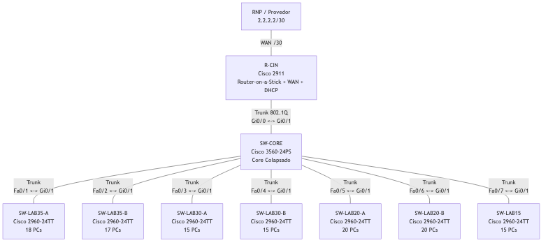

# E1 \- Design Físico e Topologia

**Grupo 1**

## 1\. Equipamentos Utilizados

| Equipamento | Modelo | Quantidade | Função na Topologia | Conexões |
| :---- | :---- | ----: | :---- | :---- |
| Roteador de Borda | Cisco 2911 | 1 | Conexão com a RNP, roteamento Inter-VLAN via Router-on-a-Stick e serviço DHCP | Gi0/0 \-\> SW-CORE Gi0/1; Gi0/1 \-\> RNP 2.2.2.2/30 |
| Switch Core | Cisco 3560-24PS | 1 | Core colapsado; agrega todos os switches de acesso e concentra os trunks das VLANs | Gi0/1 \-\> R-CIN Gi0/0; Fa0/1-Fa0/7 \-\> switches de acesso |
| Switches de Acesso | Cisco 2960-24TT | 7 | Conexão dos hosts, isolamento por VLAN e encaminhamento ao core via trunk | Gi0/1 \-\> SW-CORE; Fa0/x \-\> PCs |
| PCs | PC | 120 | Dispositivos finais dos laboratórios simulados | Placas FastEthernet \-\> portas Access dos switches |

## 2\.  Distribuição de Switches de Acesso

| Laboratório | Hosts | Switches Necessários | Justificativa |
| :---- | ----: | ----: | :---- |
| Lab 35 | 35 | 2 | Um único switch de 24 portas não comporta 35 hosts. Divisão em 18 \+ 17 hosts. |
| Lab 30 | 30 | 2 | Um único switch de 24 portas não comporta 30 hosts. Divisão em 15 \+ 15 hosts. |
| Lab 20-A | 20 | 1 | Um switch comporta todos os hosts e mantém portas livres para manutenção. |
| Lab 20-B | 20 | 1 | Um switch comporta todos os hosts e mantém portas livres para manutenção. |
| Lab 15 | 15 | 1 | Um switch comporta todos os hosts com folga. |
| **Total** | **120** | **7** | Usa todos os switches disponíveis sem desperdiçamento estrutural. |

## 3\. Nomenclatura Proposta

| Nome | Dispositivo | Laboratório / Função |
| :---- | :---- | :---- |
| R-CIN | Cisco 2911 | Roteador de borda do CIn |
| SW-CORE | Cisco 3560-24PS | Switch core colapsado |
| SW-LAB35-A | Cisco 2960-24TT | Primeira parte do laboratório de 35 hosts |
| SW-LAB35-B | Cisco 2960-24TT | Segunda parte do laboratório de 35 hosts |
| SW-LAB30-A | Cisco 2960-24TT | Primeira parte do laboratório de 30 hosts |
| SW-LAB30-B | Cisco 2960-24TT | Segunda parte do laboratório de 30 hosts |
| SW-LAB20-A | Cisco 2960-24TT | Laboratório de 20 hosts |
| SW-LAB20-B | Cisco 2960-24TT | Laboratório de 20 hosts |
| SW-LAB15 | Cisco 2960-24TT | Laboratório de 15 hosts |

## 4\. Plano de Portas Trunk

As portas trunk devem transportar as VLANs dos laboratórios entre os switches de acesso, o switch core e o roteador. Para esta entrega, considera-se uma VLAN por laboratório.

| Origem | Porta | Destino | Porta | Tipo | Observação |
| :---- | :---- | :---- | :---- | :---- | :---- |
| R-CIN | Gi0/0 | SW-CORE | Gi0/1 | Trunk 802.1Q | Link para Router-on-a-Stick; transporta todas as VLANs internas |
| R-CIN | Gi0/1 | RNP | Interface do provedor | WAN | Link externo /30 para 2.2.2.2 |
| SW-CORE | Fa0/1 | SW-LAB35-A | Gi0/1 | Trunk | Transporta a VLAN do Lab 35 |
| SW-CORE | Fa0/2 | SW-LAB35-B | Gi0/1 | Trunk | Transporta a VLAN do Lab 35 |
| SW-CORE | Fa0/3 | SW-LAB30-A | Gi0/1 | Trunk | Transporta a VLAN do Lab 30 |
| SW-CORE | Fa0/4 | SW-LAB30-B | Gi0/1 | Trunk | Transporta a VLAN do Lab 30 |
| SW-CORE | Fa0/5 | SW-LAB20-A | Gi0/1 | Trunk | Transporta a VLAN do Lab 20-A |
| SW-CORE | Fa0/6 | SW-LAB20-B | Gi0/1 | Trunk | Transporta a VLAN do Lab 20-B |
| SW-CORE | Fa0/7 | SW-LAB15 | Gi0/1 | Trunk | Transporta a VLAN do Lab 15 |

## 5\. Plano de Portas Access

As portas de acesso conectam os PCs de cada laboratório. Cada grupo de portas deve ser associado a uma VLAN específica na E3.

| Switch de Acesso | Laboratório | Portas Access para PCs | Quantidade de PCs | Observação |
| :---- | :---- | :---- | ----: | :---- |
| SW-LAB35-A | Lab 35 | Fa0/1-Fa0/18 | 18 | Mesma VLAN do Lab 35 |
| SW-LAB35-B | Lab 35 | Fa0/1-Fa0/17 | 17 | Mesma VLAN do Lab 35 |
| SW-LAB30-A | Lab 30 | Fa0/1-Fa0/15 | 15 | Mesma VLAN do Lab 30 |
| SW-LAB30-B | Lab 30 | Fa0/1-Fa0/15 | 15 | Mesma VLAN do Lab 30 |
| SW-LAB20-A | Lab 20-A | Fa0/1-Fa0/20 | 20 | VLAN própria do laboratório |
| SW-LAB20-B | Lab 20-B | Fa0/1-Fa0/20 | 20 | VLAN própria do laboratório |
| SW-LAB15 | Lab 15 | Fa0/1-Fa0/15 | 15 | VLAN própria do laboratório |

## 6\. O Design

O desenho usa uma topologia em estrela hierárquica, com todos os switches de acesso conectados ao SW-CORE.

O switch core atua como ponto de agregação e não conecta PCs diretamente. Os switches 2960 ficam responsáveis pela camada de acesso, enquanto o 3560 concentra os uplinks e distribui os trunks.

Os laboratórios maiores foram divididos em dois switches porque excedem a capacidade prática de um único 2960-24TT para hosts.