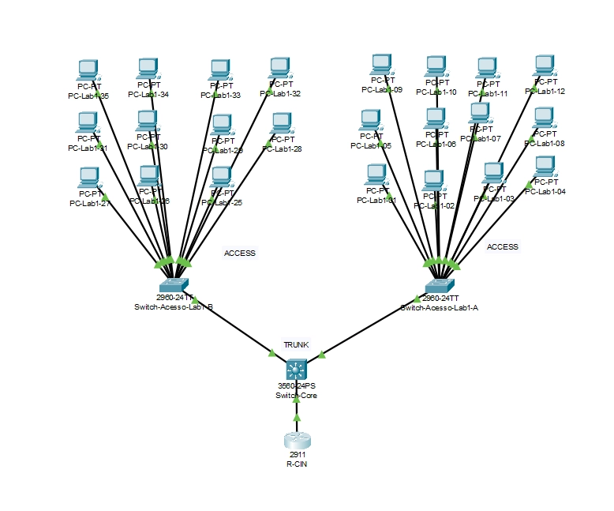

# E1 - Design Físico e Topologia

# E1 - Design Físico e Topologia

**Data de Entrega: 01/05/2026**

**Critério Principal:** **Racionalidade** - seu design deve ser lógico, organizado e baseado em princípios sólidos de engenharia de redes.

---

## 🔧 Equipamentos do Projeto

### Roteador Cisco 2911 (R-CIN)

**Quantidade:** 1 obrigatório

**Função:**

- Roteador de borda (conecta a rede interna à RNP/Internet)
- Realiza roteamento Inter-VLAN usando a técnica Router-on-a-Stick
- Hospeda o serviço DHCP

**Por que este modelo?**

- Suporta sub-interfaces lógicas (essencial para ROAS)
- Portas Gigabit Ethernet (evita gargalos)
- Desempenho adequado para o cenário

### Switch Cisco 3560-24PS (Switch Core)

**Quantidade:** 1 obrigatório

**Função:**

- Ponto central de agregação de todos os switches de acesso
- Distribui tráfego entre as VLANs
- Configura portas trunk para transportar múltiplas VLANs

**Por que este modelo?**

- Switch **multicamada (Layer 3)** - pode rotear entre VLANs.
- Capacidade de processar tráfego em alta velocidade
- Portas PoE (Power over Ethernet) para expansão futura

### Switch Cisco 2960-24TT (Switches de Acesso)

**Quantidade:** 7

**Função:**

- Conectar os PCs de cada laboratório
- Definir portas de acesso para cada VLAN específica
- Encaminhar tráfego para o Switch Core via trunk

**Por que este modelo?**

- Switch **Camada 2** otimizado para acesso
- Suporta VLANs e segurança por porta
- Custo-efetivo para densidade de portas necessária
    
    ---
    
    ## 📊 Documentação para o Relatório
    
    Tabela com os equipamentos
    
    | Equipamento | Modelo | Qtd | Função na Topologia | Conexões |
    | --- | --- | --- | --- | --- |
    | Roteador de Borda | 2911 | ?? | ?? | Ex: N (tipo entrada)→ Dispositivo alvo, (tipo entrada) |
    | Switch Core | 3560-24PS | ?? | ?? | Ex: N (Tipo entrada) → Dispositivo alvo (Tipo entrada) |
    | Switch de Acesso | 2960-24TT | ?? | ?? | Ex: N (Tipo entrada) → Dispositivo alvo (Tipo entrada) |
    | PCs | PC | 120 | End device | Ex: N (Tipo entrada) → Dispositivo alvo (Tipo entrada) |
    
    Envie também uma captura de tela de como ficou o diagrama final.
    
    Ex. de captura de tela (lembrando que a rede será bem mais complexa que esse exemplo):
    
    
    

---

## Fundamentos Teóricos

### Modelo Hierárquico da Cisco

Para projetar redes escaláveis e eficientes, a Cisco propõe um modelo hierárquico de **três camadas**:

**1. Camada de Acesso (Access Layer)**

- Onde os dispositivos finais (PCs, impressoras) se conectam à rede
- Foco: segurança por porta, VLANs, alta densidade de conexões
- **No seu projeto:** Os 7 switches Cisco 2960-24TT (Como cada switch tem 24 entradas, os lab 1 e 2 precisarão de dois switch)

**2. Camada de Distribuição (Distribution Layer)**

- Agrega tráfego da camada de acesso
- Aplica políticas de rede e controle de acesso
- Realiza roteamento e filtragem de pacotes
- **No seu projeto:** Função combinada no Switch Core

**3. Camada Core**

- Backbone da rede
- Transporta grandes volumes de dados rapidamente
- Foco: velocidade e confiabilidade
- **No seu projeto:** Função combinada no Switch Core

### Core Colapsado (Collapsed Core)

Para redes de pequeno a médio porte, é comum **combinar** as camadas de Distribuição e Core em um único dispositivo. Isso:

- Reduz custos
- Simplifica a gestão
- Mantém a funcionalidade necessária

**No projeto do CIn:** O Switch 3560-24PS atua como Core Colapsado.

---

## Boas práticas

- **Organize visualmente:** Uma topologia limpa facilita troubleshooting futuro
- **Documente tudo:** Adicione anotações e use nomenclaturas claras para cada item.
- **Lembre-se:** Este design será a base para todas as entregas seguintes!

**Próxima etapa:** Com a topologia física pronta, você partirá para o planejamento de endereçamento IP usando VLSM (E2).