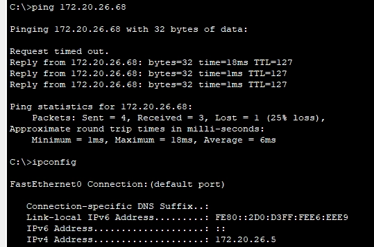
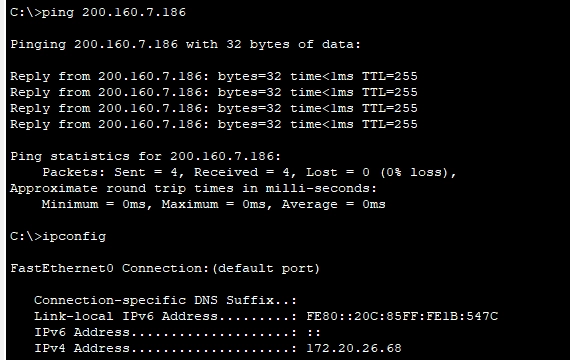
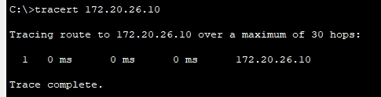
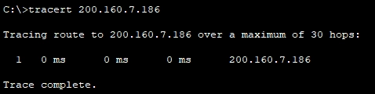

# E4 - Roteamento Inter-VLAN e Conectividade

# 🔀 E4 - Roteamento Inter-VLAN e Conectividade

**Data de Entrega:** **12/06/2026**

**Critério Principal:** **Conectividade Total** - o roteamento deve ser transparente da LAN para o backbone. PCs devem comunicar entre VLANs e com a Internet.

---

## 💻 Prática no Packet Tracer

---

## 🌐 Parte 1: Configurando o Roteamento Externo (Rota Padrão)

O objetivo desta etapa é ensinar ao seu roteador `R-CIN` o que fazer com qualquer tráfego que não seja destinado a um dos seus laboratórios internos (VLANs 10-50). Em outras palavras, vamos criar o caminho para a "internet", que em nosso projeto é representada pela RNP.

Para fazer isso de forma limpa, sem adicionar outros equipamentos à topologia, usaremos uma **Interface de Loopback**. Pense nela como uma interface de rede virtual, sempre ativa, que existe dentro do próprio roteador, perfeita para simular um destino externo.

### Requisito Obrigatório

- Para esta simulação, o destino que representa a RNP **deve ser obrigatoriamente** o endereço IP `200.160.7.186`.

### Comandos Úteis

### Etapa A: Simular o Destino da RNP

Primeiro, precisamos criar o ponto final virtual da nossa conexão.

- `interface Loopback<número>`
    - **Função:** Cria uma interface de rede virtual. É uma prática comum usar o número `0` (ex: `Loopback0`).
- `ip address <endereço_ip> <máscara>`
    - **Função:** Atribui um endereço IP à interface. Para a Loopback, você deve usar o endereço obrigatório da RNP.
    - **Dica Importante:** Como `200.160.7.186` representa um único servidor e não uma rede, a máscara de sub-rede mais apropriada é `255.255.255.255` (uma máscara `/32`).
- `description <texto_descritivo>`
    - **Função:** Permite adicionar um comentário à interface. É uma excelente prática de documentação para lembrar o que aquela interface faz (ex: `Simulacao_Conexao_RNP`).

### Etapa B: Criar a Rota Padrão

Agora, vamos criar a regra que diz: "se você não conhece o destino, envie o tráfego por este caminho".

- `ip route 0.0.0.0 0.0.0.0 <interface_de_saída>`
    - **Função:** Cria uma rota estática.
    - **`0.0.0.0 0.0.0.0`**: Esta combinação especial significa "qualquer rede com qualquer máscara". É a definição de uma rota padrão.
    - **`<interface_de_saída>`**: Aqui, você deve especificar para onde o tráfego deve ser enviado. Neste caso, será a interface de Loopback que você criou na Etapa A.

Use esses blocos de construção para implementar a conectividade externa da sua rede!

---

## 🧪 Testes de Conectividade

Agora vem a parte mais importante: **provar que tudo funciona!**

### Teste 1: Obter IP via DHCP

1. **Abra um PC** em cada laboratório
2. Vá em **Desktop → IP Configuration**
3. Selecione **DHCP**
4. Aguarde alguns segundos

**Resultado esperado:** ✅

- O PC deve receber um IP da sub-rede correta
- Gateway deve ser o IP configurado na sub-interface
- DNS deve ser 8.8.8.8

**Exemplo para PC no Lab 1:**

- IP Address: 172.20.1.2 (ou outro IP disponível da sub-rede)
- Subnet Mask: 255.255.255.192
- Default Gateway: 172.20.1.1
- DNS Server: 8.8.8.8

### Teste 2: Ping Intra-VLAN

**Objetivo:** Verificar comunicação dentro da mesma VLAN

1. De um PC no Lab 1, faça ping para outro PC no Lab 1

```
C:\> ping 172.20.X.10
```

**Resultado esperado:** ✅ Reply from 172.20.X.10

### Teste 3: Ping para o Gateway

**Objetivo:** Verificar que o PC consegue alcançar seu gateway

```
C:\> ping 172.20.X.1
```

**Resultado esperado:** ✅ Reply from 172.20.X.1

### Teste 4: Ping Inter-VLAN (CRUCIAL!)

**Objetivo:** Provar que o roteamento Inter-VLAN funciona

De um PC no Lab 1 (VLAN 10), faça ping para um PC no Lab 2 (VLAN 20):

```
C:\> ping 172.20.X.70
```

**Resultado esperado:** ✅ Reply from 172.20.X.70

**⚠️ Observação:** O primeiro ping pode falhar (timeout) devido ao processo ARP. Os seguintes devem ter sucesso!

**Se não funcionar, verifique:**

- O ip DHCP foi configurado nos dois pcs da conexão
- Sub-interfaces criadas e com IPs corretos?
- Interface física Gi0/0 está ativa (no shutdown)?
- Portas trunk configuradas corretamente?

### Teste 5: Ping Externo (RNP)

**Objetivo:** Verificar conectividade externa via rota padrão

```
C:\> ping 200.160.7.186
```

**Resultado esperado:** ✅ Reply from 200.160.7.186

**Significado:** O PC consegue alcançar a RNP/Internet!

### Teste 6: Traceroute (Evidência Visual)

**Objetivo:** Mostrar o caminho que os pacotes percorrem

De um PC no Lab 1, rastreie o caminho até um PC no Lab 2:

```
C:\> tracert 172.20.X.70
```

**Resultado esperado:**

```
Tracing route to 172.20.X.70 over a maximum of 30 hops:

  1   <1 ms   172.20.X.1      (Gateway da VLAN GRAD 1)
  2   <1 ms   172.20.X.70     (PC de destino na VLAN GRAD 2)

Trace complete.
```

**📸 IMPORTANTE:** Capture a tela deste traceroute! É a melhor evidência de que o roteamento Inter-VLAN está funcionando.

### Teste 7: Traceroute externo

**Objetivo:** Mostrar o caminho que os pacotes percorrem

De um PC no Lab 1, rastreie o caminho até um endereço externo:

```
C:\> tracert 200.160.7.186
```

**Resultado esperado:**

```
Tracing route to 200.160.7.186 over a maximum of 30 hops:

  1   <1 ms   172.20.X.1      (Gateway da VLAN GRAD 1)
  2   <1 ms   200.167.7.186     (PC de destino externo)

Trace complete.
```

**IMPORTANTE:** O unico endereço externo configurado é 200.160.7.186 então testar outro ip alem desse não vai funcionar, pois esse endereço não consegue simular a internet inteira e buscar por um ip aleatorio.

---

## 📊 Documentação para o Relatório

### Evidências de Conectividade (Screenshots)

Inclua no relatório capturas de tela como nos exemplos abaixo, lembre-se de testar com ips diferentes dos exibidos nos prints.

### Exemplo:

1. ✅ Ping intra-VLAN bem-sucedido (172.20.X.5 → 172.20.X.68)



1. ✅ Ping inter-VLAN bem-sucedido (ex: 172.20.X.68 → 200.160.7.186) 



1. ✅ Saída do comando `tracert 172.20.X.10` no terminal do pc
    
    
    
2. ✅ Saída do comando `tracert 200.160.7.186` no terminal do pc



1. ✅ Saída do comando `show ip route` no roteador

---

## 📖 Fundamentos Teóricos

### Por que precisamos de roteamento?

**Problema:** VLANs são domínios de broadcast **isolados**

- PC na VLAN 10 não consegue falar com PC na VLAN 20
- Cada VLAN é uma sub-rede IP diferente
- Switches de Camada 2 não roteiam entre redes

**Solução:** Usar um dispositivo de **Camada 3** (roteador) para encaminhar pacotes entre VLANs

### O que é Router-on-a-Stick (ROAS)?

**Router-on-a-Stick** é uma técnica que permite ao roteador rotear entre múltiplas VLANs usando apenas **uma interface física**.

**Como funciona:**

1. Interface física do roteador conecta ao switch por uma porta **trunk**
2. Interface física é dividida em **sub-interfaces lógicas**
3. Cada sub-interface representa uma VLAN (usando encapsulamento 802.1Q)
4. Cada sub-interface recebe o IP do gateway daquela VLAN/sub-rede

**Analogia:** É como um carteiro (roteador) que usa um único portão (interface física) mas tem chaves diferentes (sub-interfaces) para acessar vários apartamentos (VLANs).

**Exemplo de fluxo:**

1. PC-Lab1 (VLAN 10, IP .10) quer falar com PC-Lab2 (VLAN 20, IP .70)
2. PC-Lab1 envia pacote para seu gateway (172.20.1.1)
3. Switch recebe e encaminha pela porta trunk para o roteador com tag VLAN 10
4. Roteador recebe na sub-interface .10
5. Roteador consulta tabela de roteamento
6. Roteador encaminha pela sub-interface .20 com tag VLAN 20
7. Switch recebe e entrega ao PC-Lab2

### O que é Rota Padrão (Default Route)?

**Rota Padrão** é uma rota "coringa" que diz ao roteador: *"Para qualquer destino que você não conhece, envie os pacotes para este próximo salto"*.

**Representação:** 0.0.0.0/0 ou 0.0.0.0 0.0.0.0

**No projeto:**

- Destinos internos (VLANs): Roteados pelas sub-interfaces
- Destinos externos (Internet): Encaminhados para a RNP via rota padrão

---

## 💡 Dicas e Troubleshooting

### Problema: DHCP não funciona

**Possíveis causas:**

- Sub-interfaces não configuradas → PCs não conseguem alcançar o gateway
- Interface física desativada → Nada funciona

**Solução:**

```
R-CIN# show ip interface brief
```

Todas as interfaces devem estar up/up

### Problema: Ping inter-VLAN falha

**Diagnóstico passo a passo:**

1. **PC consegue fazer ping no gateway?**
    - Não → Problema na configuração de acesso ou VLAN
    - Sim → Continue
2. **Gateway tem rota para a rede de destino?**
    
    ```
    R-CIN# show ip route
    ```
    
    - Não → Sub-interface destino não configurada
    - Sim → Continue
3. **Trunks configurados corretamente?**
    
    ```
    Switch# show interfaces trunk
    ```
    
    - Verificar se VLANs estão permitidas nos trunks

### Problema: Primeiro ping falha, mas os seguintes funcionam

**Isso é NORMAL!** ✅

**Explicação:** O primeiro pacote é perdido enquanto o protocolo ARP (Address Resolution Protocol) resolve o endereço MAC do gateway. Pings subsequentes usam o cache ARP e funcionam normalmente.

### Boas práticas

**✅ Dica 1:** Sempre use `show ip route` para verificar se as rotas estão corretas

**✅ Dica 2:** Use `show ip interface brief` para verificar status das interfaces

**✅ Dica 3:** Teste sempre em ordem: intra-VLAN → gateway → inter-VLAN → externo

**✅ Dica 4:** Documente TUDO! Screenshots valem ouro na apresentação

**Próxima etapa:** Com a rede totalmente funcional, você preparará a apresentação final consolidando todas as entregas e demonstrando a conectividade total (E5).